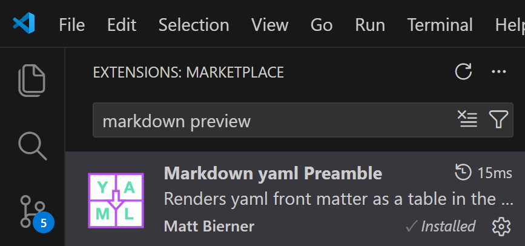
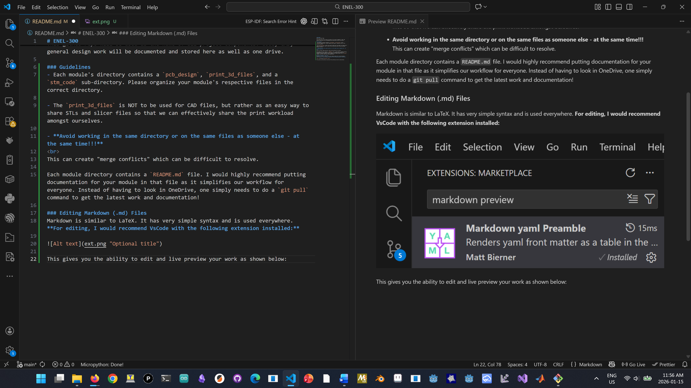

# ENEL-300
ENEL 300 Project Repo

This github repo will be used as the home of all project components. Code, CAD, general design work will be documented and stored here as well as one drive. 

### Guidelines
- Each module's directory contains a `pcb_design`, `print_3d_files`, and a `stm_code` sub-directory. Please organize your module's respective files in the correct directory. 

- The `print_3d_files` is NOT to be used for CAD files, but rather as an easy way to share STLs and slicer files so that we can effectively share the print workload amongst ourselves.

- **Avoid working in the same directory or on the same files as someone else - at the same time!!!** 
 
This can create "merge conflicts" which can be difficult to resolve.

Each module directory contains a `README.md` file. I would highly recommend putting **technical** documentation for your module in that file as it simplifies our workflow for everyone. Instead of having to look in OneDrive, one simply needs to do a `git pull` command to get the latest work and documentation!

Only use OneDrive for **administrative** documentation.

### Editing Markdown (.md) Files
Markdown is similar to LaTeX. It has very simple syntax and is used everywhere. **For editing, I would recommend VsCode with the following extension installed:**

 
This gives you the ability to edit and live preview your work as shown below:
 
 

### **To open the preview:** `Ctrl + Shift + P` then type `Markdown: Open Preview`

Drag the preview tab to the right pane and viola!

### Branches
Branches allow you to work on your own module without messing up somebody else's work. Changes you make in your own branch will NOT affect work done in another branch. Overtime, we will merge everyone's changes into the `main` branch. **DO NOT directly edit your work in the main branch.**  *The main branch is supposed to be the "working" version.* The division of a project into branches is unavoidable in industry.

I have created branches for each module.

1. Switching between branches
 
    `git checkout main` -- switch to the main branch
 
    `git checkout controller_board` -- switch to the controller_board branch

Commits and pushes will only apply to your respective branch. 

1. To view the current branch you are in
 `git branch`

### Pushing, Pulling, Adding, Committing
NOTE: A commit is like a snapshot of your project. You can revert your project back to any previous commits.
 
1. Whenever you want to work on the project, first sync your local repo with the remote repo (the one on GitHub):
 `git pull`

2. Before you plan to make major changes or upload your changes, *especially ones that may break your code:*
 `git add -A`
 `git commit -m "What ever message you want in these quotes"`

3. Uploading the latest commit `git push`
